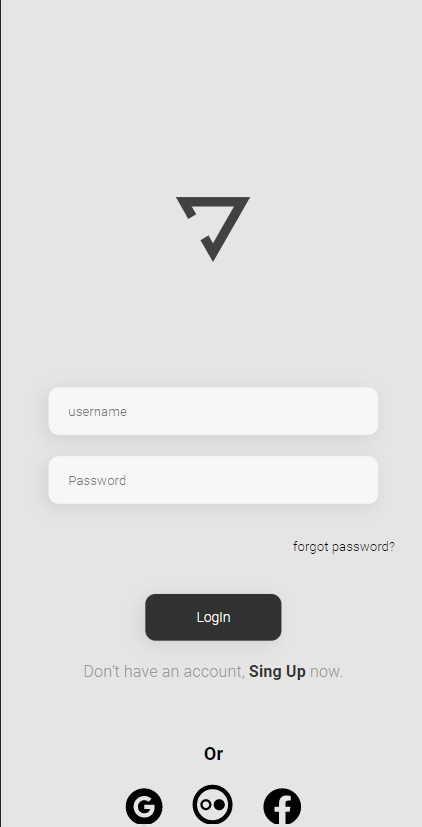

# "Login DevClub"

## 🎞️  <"img">

  

> "Mais um projeto do DevClub, tela de login usando só HTML E CSS"

<h3 align="center">
    <a href="https://nocolork.github.io/Yoga/">Acessar a demonstração</a>
<h3 >
 

## 💻 Tecnologias utilizados
<li align="left"> HTML </li>

<li align="left"> CSS </li> 
 

## 😄 Feito Por João Vitor Brehmer
 

  🦄 <strong>My work page on github.  ⤵️</strong>

  <a href="https://github.com/NoColork?tab=repositories">
    
    </img>
  </a>

Contatos... 

  
   

  